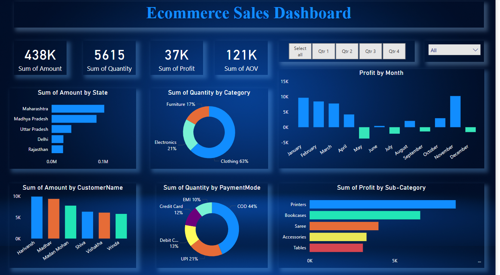

# 📊 Ecommerce Sales Dashboard – Power BI

> A powerful, visually immersive Power BI dashboard designed to analyze ecommerce sales performance across regions, categories, customer segments, and time. This project provides key business insights that help drive data-informed decisions.

---

## 🔍 Overview

- **Total Sales, Profit, Quantity & AOV** – KPI cards to track overall performance
- **State-wise Revenue** – Discover top-performing regions
- **Category & Sub-Category Insights** – Track demand and profitability by product type
- **Customer Breakdown** – View key buyers contributing to revenue
- **Payment Mode Analysis** – Evaluate popular payment preferences (UPI, COD, EMI, etc.)
- **Monthly Profit Trends** – Identify seasonal opportunities or dips
- **Interactive Filters** – Analyze by quarter and product category dynamically

---

## 📁 Files Included

| File | Description |
|------|-------------|
| `Ecommerce_Sales_Dashboard.pbix` | Main Power BI dashboard file |
| `Assets/Ecommerce_Sales_Dashboard.png` | Dashboard image preview |
| `Assets/Ecommerce_Sales_Dashboard_Flow.mp4` | Optional walkthrough of the dashboard |

---

## ▶️ Preview

> Click on the image to play the walkthrough video if video doesn't opens then please download and run it locally.

---

## 🛠 Tools & Skills Used

- Power BI
- DAX (Data Analysis Expressions)
- Data Modeling
- Data Cleaning & Transformation
- Visualization & Storytelling

---

## 📬 Contact

**Namrata Joshi**  
_Data Analyst_  
📧 njpareek256@gmail.com  
🌐 [LinkedIn](https://www.linkedin.com/in/namrata-pareek-3415b521b/)

---

⭐ _If you like this project, feel free to star this repo or connect with me!_
